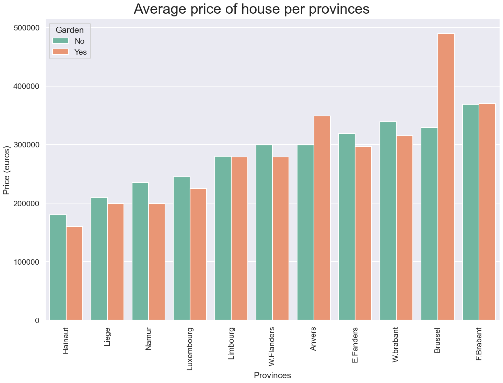
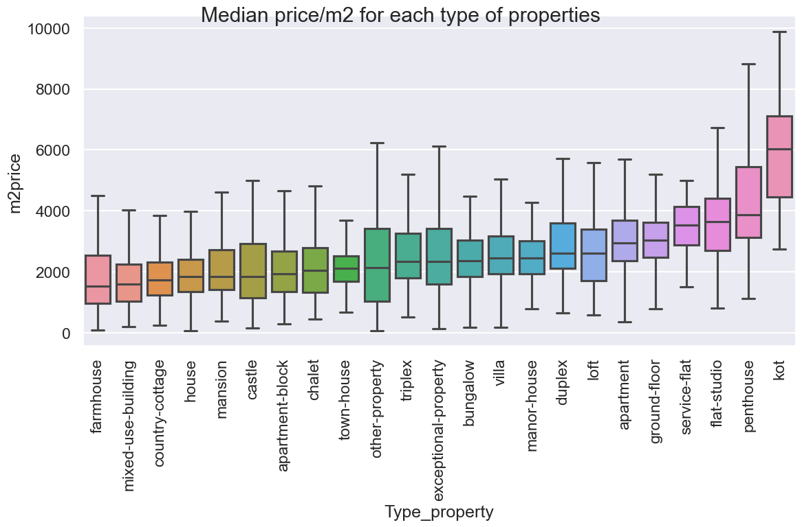

[![Contributors][contributors-shield]][contributors-url]

<h2 align="center"> Immoweb project </h2>

<h3 align="center">Data collectioning and analysis project as a part of Data&AI training at <a href="https://github.com/becodeorg"><strong>BeCode</strong></a></h3>  

# Description
This is a project about data collection and data analysis. It is done in multiple part. 
- The first part was a group project :

Our program will scrape a real estate website ([Immoweb](https://www.immoweb.be/en)) for data about houses and apartments
in Belgium. Once the information is fetched it will be cleaned and stored in a CSV file.

- The second part was a solo project :

This part is about data cleaning and data visualisation. Help us discover pandas librairies and the tools to visualize datas. Understand the link between datas and starting to be more confident to work with them. I took a dataFrame that's not related to the first part because we didn't manage to get a good one.

# Scraping part

## Installation

1. Clone the repo
2. Install the required libraries
3. Install Selenium WebDriver
4. Run main.py

## Starting and running

After starting, our program there is 4 different Python Documents

1- get_links.py : this document using the Selenium and Beautiful Soup libraries to scrape a website for links.

The driver_gen() function initializes a webdriver object using the Chrome browser and returns it.

The get_links() function takes two arguments: iterations and driver. It then creates an empty list called list_of_link. The function then iterates over the values in iterations and for each value, it builds a URL and visits it using the driver. It then creates a Beautiful Soup object from the page source and uses it to find all a tags with a class of card\_\_title-link. It appends the href attribute of each of these tags to list_of_link and then quits the driver. Finally, it returns list_of_link.

The link_file() function takes one argument, datas, and writes it to the file specified in the test variable, with a newline character at the end.

-

2- threads.py : This document using the get_links() function from another module (presumably called get_links) to scrape a website for links and write them to a file.

The pool() function takes two arguments: numbers_drivers and pages. It creates a list of numbers_drivers webdriver objects using the driver_gen() function and stores it in the drivers list. It then divides the range of integers from 1 to pages into numbers_drivers equal parts using numpy.array_split() and stores the resulting list of arrays in division.

Next, it creates a thread pool using ThreadPoolExecutor and a with block. It then uses the map() method of the executor to apply the get_links() function to each element in division with the corresponding element in drivers. Finally, it iterates over the results of this operation, writing each element to the file specified in the test variable using the link_file() function.

-

3- cleaning.py :t his document using the BeautifulSoup library to parse an HTML page and extract information from it. It appears to be using the requests library to make HTTP requests to retrieve the HTML pages.

The clean_data() function reads the links from a file and makes an HTTP GET request to each of these links using the requests library. It then creates a Beautiful Soup object from the HTML content of the page and finds all script tags in the page. It passes this list of tags to the organise_data() function and returns the result of this function.

The organise_data() function takes a list of script tags as its argument. It then iterates over the list and checks if either "window.dataLayer" or "window.classified" is present in the script tag. If either of these is present, it extracts certain information from the tag and stores it in variables. It then creates an empty dictionary called property_details and adds key-value pairs to it using the extracted information. Finally, it appends property_details to a list called list_of_properties and returns this list.

The save_to_csv() function takes a list of dictionaries as its argument and creates a Pandas DataFrame from it. It then writes this DataFrame to a CSV file and returns the file's name.

-

4- main.py: Main code for running the program and pool function.
# Data visualisation Part 

## Installation

1. Clone the repo
2. Install pandas 
3. Install matplotlib and seborn
4. Run all cells in the Data visualisation.ipynb

## Starting and running

1- Data cleaning 

In the data cleaning part we can find all work on the dataset to be able to work with. First we check for empy rows of information and then see if we get rid of the rows by seeing how many there are missing. And after that we get rid of the different columns we don't need for the different exploration. After that we change the types of the columns to have types that work in plots. We create new collums based on the other colums, as the provinces colums and the Price/m2 column. At the end of the cleaning we get rid of outliers for numeric columns. 

2- Data Analysis

The data analysis is principaly the correlation graph and the understanding of the differents values and how they interact with each other.

3- Data Interpretation 

The data interpretation part is where the magic happen. We start to create graphs of the values. In this part I've principaly worked on the questions we had to answer to. 
My first question was : In wich province is a house with a garden cheaper ?
to answer this question I first plotted the price in each province for the sales in a bar graph. After that i wanted to know the mean size of garden in each province. And after that i continued to plot some information to have a better understanding of the datas about gardens. 

My second question was: What is the difference of price comparing renovated house and to renovate ones with the same Living area ? 
Started to scatter plot the information to see a trends but it was a little bit too crowded sor I change the type of my graph to use a density graph and put them one beside the other. 

I worked on type of property too, I wanted to know in wich province the castle where the cheaper in average. and plotted the difference of the prices for each typ of property. 

After this I selected some other interesting plots that I encounter during my researchs.

## Visuals 
I wanted to put some plots for references here : 

In wich province is a property with a garden cheaper ? 

What is the difference of price comparing renovated house and to renovate ones with the same Living area ? 

What is the average size of garden per provinces

## Authors

> [Anil](https://github.com/anilembel)

> [Héloïse](https://github.com/Yheloww)

> [Anh](https://github.com/AnhSN)

<!-- CONTACT -->

## Contact

Please, contact any of the authors via GitHub.

<!-- MARKDOWN LINKS & IMAGES -->
<!-- https://www.markdownguide.org/basic-syntax/#reference-style-links -->

[contributors-shield]: https://img.shields.io/github/contributors/CorentinChanet/challenge-collecting-data.svg?style=for-the-badge

[contributors-url]: [https://github.com/Yheloww/real-estate-price-prediction/graphs/contributors]
