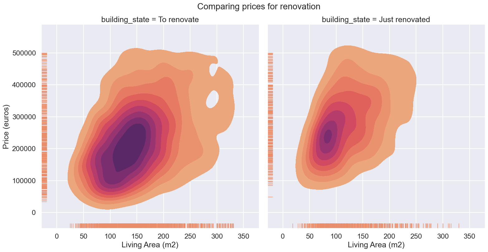

[![Contributors][contributors-shield]][contributors-url]

<h2 align="center"> Immoweb project </h2>

<h3 align="center">Data collectioning, Data analysis, ML prediction and model deployement as a part of Data&AI training at <a href="https://github.com/becodeorg"><strong>BeCode</strong></a></h3>  

# Description
- The first part was a group project :

Our program will scrape a real estate website ([Immoweb](https://www.immoweb.be/en)) for data about houses and apartments
in Belgium. Once the information is fetched it will be cleaned and stored in a CSV file.

- The second part was a solo project :

This part is about data cleaning and data visualisation. Help us discover pandas librairies and the tools to visualize datas. Understand the link between datas and starting to be more confident to work with them. I took a dataFrame that's not related to the first part because we didn't manage to get a good one.

- the third part was still a solo project :

This part is about modelling, try and experiment with machine learning; discovering algorithms, evaluation of the model, preprocessing ....
first contact with AI for me. 

-the fourth and final part was also a solo project:

this part is about the deployement of a model, I created a flask app and deployed it with the help of some tools as docker and render. 
[The application](https://prediction-mhn8.onrender.com/)

# Scraping part

## Installation

1. Clone the repo
2. Install the required libraries
3. Install Selenium WebDriver
4. Run main.py

## Starting and running

After starting, our program there is 4 different Python Documents

1- [get_links.py](src\data_acquisition\get_links.py) 

This file is to get the links from immoweb website. I iterates over the different belgian provinces and each times it checks if it is not the last pages for the province. If it is it goes to the next provinces till all provinces have been scrape. On each page the selenium driver get the links for each property and put it in a list. Then the list is saved in a txt file to be used in the cleaning part

2- [threads.py](src\data_acquisition\threads.py)

This file is about threading. THe incroporation in the code hasn't been finished but it uses a Pool of threads to cut the numbers of page it has to scrape and each thread get a part of the work so it goes faster. (still need to be implemented in the final version)

3- [cleaning.py](src\data_acquisition\cleaning.py)

This file regroup the functions that iterates over the list of links to get all the informations needed. It gets the scripts of the pagges and then with the help of a dictionary it creates information column for each property and it is stocked in a pandas dataframe for the next part

4- [main.py](src\data_acquisition\main.py)

This file get all the functions from all the files from before and organises it to have the final Dataframe into a csv file. 

# Data visualisation Part 

## Installation

1. Clone the repo
2. Install pandas 
3. Install matplotlib and seborn
4. Run all cells in the Data visualisation.ipynb

## Starting and running

these part are all done in [Data_visualisation](notebook\Data_visualisation.ipynb)

1- Data cleaning 

In the data cleaning part we can find all work on the dataset to be able to work with. First we check for empy rows of information and then see if we get rid of the rows by seeing how many there are missing. And after that we get rid of the different columns we don't need for the different exploration. After that we change the types of the columns to have types that work in plots. We create new collums based on the other colums, as the provinces colums and the Price/m2 column. At the end of the cleaning we get rid of outliers for numeric columns. 

2- Data Analysis

The data analysis is principaly the correlation graph and the understanding of the differents values and how they interact with each other.

3- Data Interpretation 

The data interpretation part is where the magic happen. We start to create graphs of the values. In this part I've principaly worked on the questions we had to answer to. 
My first question was : In wich province is a house with a garden cheaper ?
to answer this question I first plotted the price in each province for the sales in a bar graph. After that i wanted to know the mean size of garden in each province. And after that i continued to plot some information to have a better understanding of the datas about gardens. 

My second question was: What is the difference of price comparing renovated house and to renovate ones with the same Living area ? 
Started to scatter plot the information to see a trends but it was a little bit too crowded sor I change the type of my graph to use a density graph and put them one beside the other. 

I worked on type of property too, I wanted to know in wich province the castle where the cheaper in average. and plotted the difference of the prices for each typ of property. 

After this I selected some other interesting plots that I encounter during my researchs.

# Model  

## Installation

1. Clone the repo
2. Install pandas 
3. Install sklearn
4. Run the main.py file in model_training folder

## Starting and running
1- notebooks (model_training and reworkdata)

The notebooks are my experiments. They are there to show my thinking and my different experiment before putting everything into Python file. My challenge this part was to clean everything at the end to have clear and better organised code. But I still decide to keep notebooks as we are in a learning process so we can see my reflections. 

[model_training.ipynb](notebook\model_training.ipynb) - is the experimentations with algorithms and cross validation. 
I tested 2 algorithms for now :
 - Linear Regression 

 - Gradient Boosting regressor 

The second one gives better results so I use it in my final file. 

I also test CV search and randomized search to tune the hyperparameters of the gradient boosting algoritms. THe results of these tests are in the model_perf folder: [CV](model_perf\cv_results.csv), [random_CV](model_perf\cv_random_results.csv)

[reworkdata.ipynb](notebook\reworkdata.ipynb) - is the modification I did to feed the data frame for the model. I changed some things from the data visualisation part but in the idea it is quite the same process. Just at the end I add the pd.dummies from pandas to use for categorical datas. And then I save the dataset into [preprocessed.csv](data\preprocessed.csv).

2- [Preprocessing.py](src\model_training\preprocessing.py) 

It is a cleaned version of the reworkdata Jupyter notebook. I created functions to start the automation of the process of cleaning. 
The idea is to feed the columns names to the function.
- get_dataframe()
- replace_nan()
- drop_nan()
- changes_types()
- create_col()
- remove outliers()
- get_dummies()

3- [model_train.py](src\model_training\model_train.py) 

It is a cleaned version of the model_training jupyter notebook. It separate the process into functions to be able to change the algorithms that we use easily. 

- get_dataframe()
- get_X_y()
- model_training()
- eval_model()

4- [main.py](src\model_training\main.py)

It is the file that put the preprocessing and the model_training together. Possible to use it and change the algorithms as wanted. 

The final rsquared score that I have for my model is 0.66. 

## Interpretation of the model performances

As I said before this was my first project using machine learning. It was a lot of new things to learn and to get into. 

the 0.66 score isn't that bad if you want my advice for now. 
But why is it not 0.75 or 0.8 ?

I have several ideas of what could be the cause of this medium-low score.

- fetures : 

I tried to implement as features as possible from my dataset, each new feature got my score higher. but at one point I was stuck because I didn't had enough informations to predict very well the prices. So the first hypothesis is the limitation of the dataframe, maybe we miss some very important information that influences the price greatly. Maybe is the repartition of the values.  But the next step would be to go back to the sraping part and scrape more datas, and ones that are more representative of the market in Belgium. 

- algorithms : 

The second possibility is the choice of algorithms, I tried to have a good score with linear refression first and then tried another algorithm. I didn't had the time to dive deep into algorithms to select the best one. But that's my next step, try to understand different algorithms and see wich one is the more adapted for each ML problem. 

# Deployement

## Installation

1. Clone the repo
2. Install flask flaks_wtf 
3. Install Docker
4. Go on render.com 

or 

https://prediction-mhn8.onrender.com/

## Usage 

the final stage of this project is here ; the deployement of the website

The website has a goal to take in new informations that a user would give it and then use our model to estimates the price of the real estate described.

Here is a picture of the fist page of the website; it is the form where the user can put informations, this form has been made with flask wtforms and some html and bootstrap for the rest. 

Here is a picture of the page where the results appear

Has it has been deployed with render, now using the link everyone has access to this website. 
In the repository of the website there's also a Dockefile, with wich I've created a Docker container with everything. 

# Visuals 
These are the plots from my visualisations. I've regrouped the ones that I thought gave the best insights on the dataset here. But there's more in the [Data_visualisation](notebook\Data_visualisation.ipynb) notebook. 

### In wich province is a property with a garden cheaper ? 

We can see that the cheapest provinces is hainaut for a house with a garden. With this graph we also see that the median price of houses doesn't change much if we have a garden or not in general. Except in brussel but it is a big city so that's normal. 

### What is the difference of price comparing renovated house and to renovate ones with the same Living area ? 

We can see that the offer of houses to renovate is bigger than the just renovated ones. Also we can observe that the offer of to renovate house has a bigger range , the most crowded zone goes from 100.000 to 300.000 with a living area between 50 and 200 m2square. In the just renovated the zone goes from almost 200.000 to 300.000 with a living_area between 50 to 100 m2square.

### What is the average size of garden per provinces ? 

We can see that the average size of garden in each provinces is quite similar and is around 45 msquared. 

### median price for building state : 

###  what is the most expensive type of property in m2square ?

we can see that the kot(student lodging) is the most expensive in m2square. 

# Authors
1- Scraping part (group work)
> [Anil](https://github.com/anilembel)

> [Héloïse](https://github.com/Yheloww)

> [Anh](https://github.com/AnhSN)

2-3 Data visualisation, modelling and Deployement (solo part)

> [Héloïse](https://github.com/Yheloww)
<!-- CONTACT -->

# Contact

Please, contact any of the authors via GitHub.

<!-- MARKDOWN LINKS & IMAGES -->
<!-- https://www.markdownguide.org/basic-syntax/#reference-style-links -->

[contributors-shield]: https://img.shields.io/github/contributors/CorentinChanet/challenge-collecting-data.svg?style=for-the-badge

[contributors-url]: [https://github.com/Yheloww/real-estate-price-prediction/graphs/contributors]
